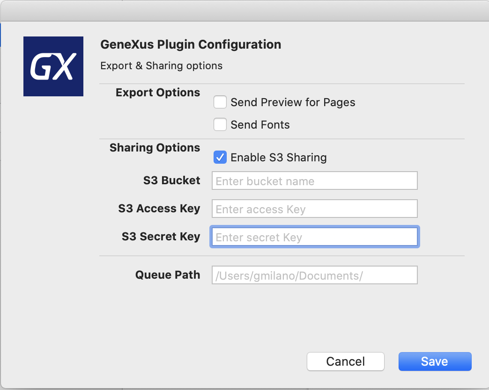

# sketchdesignops
A plugin for sketch in order to simplify exchange of assets and design between designers and developers

# How to install

Download the latest Release and double click the .sketchplugin

# How to use it

Open any sketch file, under Plugins/GxDesignOps you will have several commands.

1) Configure

It's the first step you need to set, you can choose to share assets between developers through a shared folder or by using
a AWS S3 bucket.
So choose one of them and set their properties. If you want to share by using AWS S3 you must to obtain a valid Access Key and Secret Key from AWS IAM for the given bucket name.

If you are going to share by a shared folder just be sure both developers and designers have access to the given folder.

2) Send GeneXus Format

This is the recommended option to share design between GeneXus Developers and Designers.
GeneXus Format can contain all the information needed to be used with the GeneXus Sketch Inspector in the GeneXus IDE.

The GeneXus Format (.gxsketch) is just a zip format with the following structure:

- gx
    - gx-preview  (When Send Preview Pages is enabled , Images for all pages are included here, to be used by the inspector to show preview to developers)
    - fonts (When the Export Fonts options in the Configuration is enabled, all referenced fonts are copied here)
    - <sketch file>  The actual sketch document
    - <sketch file name>Images (Contains all the exportable images inside the sketch file)

Take into account that if you have the options Send Preview Pages and Export Fonts enabled the size of the exported file can be too big in big sketch designs. So after sending once fonts for example you can disabled the Export Fonts option.

3) Send Only Sketch file

As the command say it only will share the actual sketch document.

# Output

The plugin will copy the current .sketch or .gxsketch file and all the exportable images to the shared folder Queue or to the given S3 bucket.
